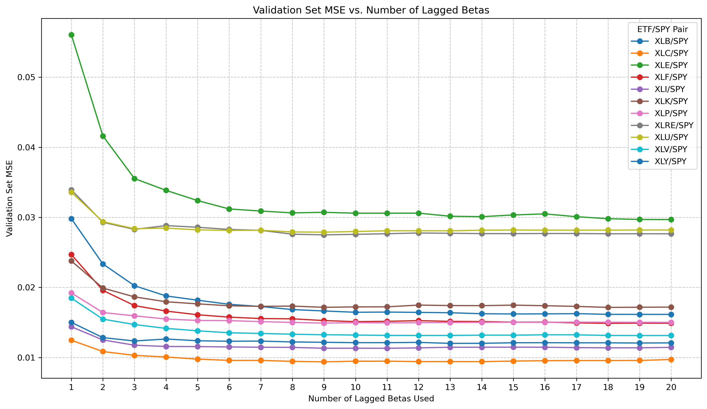
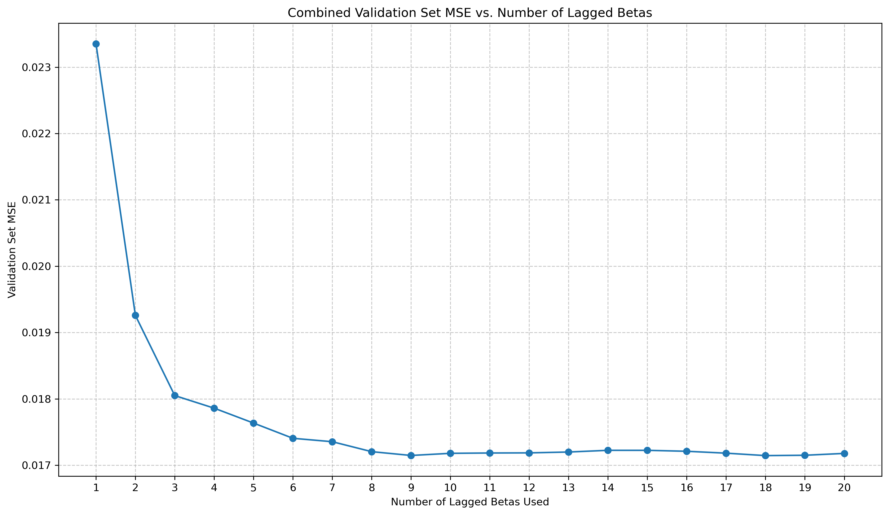
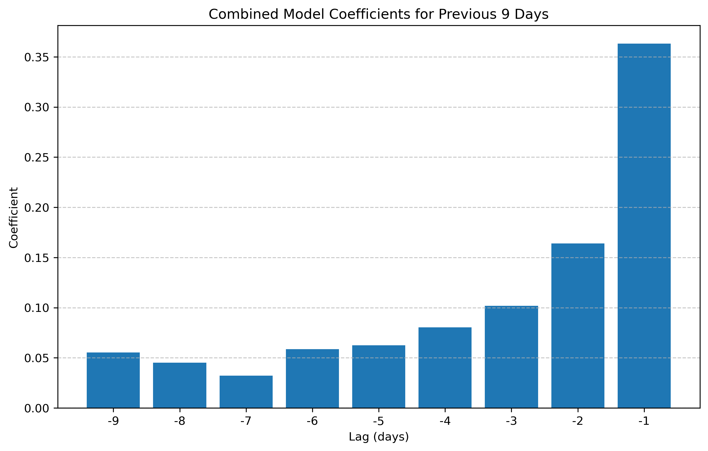
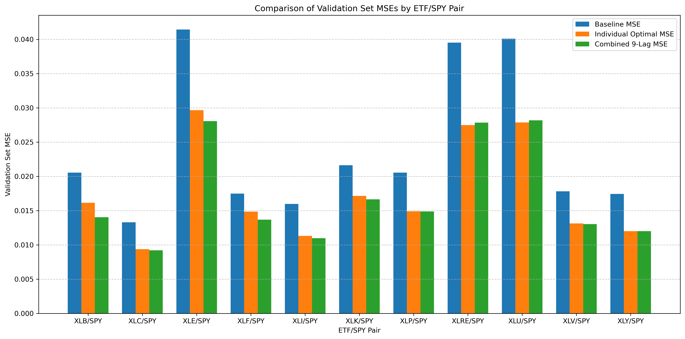

## Repository: UCB_Required_Assignment24_1

### Assignment: Required Capstone Project 24.1: Final Report

### Title: Predicting Stock Market Betas for Equity Pairs

### Author: Bart Rothwell

### Date: 3/23/2026

### Link to Jupyter Notebook with Full Data Analysis

https://github.com/bartrothwell/UCB_Required_Assignment24_1/blob/main/RequiredAssignment24_1_Rothwell.ipynb

#### 1 Introduction

This README file summarizes the data analysis performed for my Capstone Project, in which I investigate the relative price movements of pairs of stocks traded on the US stock market.

##### 1.1 Research Question

The research question addressed in this study is whether a model can be developed that accurately predicts the future relationship between the price movements of two stocks. The pairwise price movement of two stocks is usually modeled as a linear relationship, where “Beta” is defined as the ratio of the price change of one stock to the price change of the other. For example, the Beta of a major ETF that tracks the technology sector (ticker: XLK) to the highly liquid ETF that tracks the entire S\&P 500 (ticker: SPY) is historically about 1.2, meaning that if SPY goes up by 1.0% on a given day, XLK is expected to rise by about 1.2% on that day.

Many factors go into the Beta that is realized in the stock market, and the Beta for each pair of stocks varies over time. The specific goal of this study is to develop a model that will predict the next day's Beta for two stocks more accurately than just using the historical Beta, either for the last day or a set of previous days, as is commonly done by stock market traders.

The stocks that were selected for this study are the 11 S\&P 500 sector SPDR ETFs (the “Select Sector SPDRs”) that are issued by State Street and commonly used to split the S\&P 500 into its full sector breakdown, as well as the SPDR S\&P 500 ETF "SPY" that tracks the S\&P 500 itself. The goal will be to predict the Beta of each of the 11 sector ETFs (e.g. XLK) against SPY.

##### 1.2 Motivation

Knowing the Beta of one stock to another is important to stock market traders so that they can calculate a “hedge ratio” for the two stocks – the number of shares of one stock they want to be short in order to offset a long position in the other stock, to minimize their risk when doing a pair trade in which they expect one stock to outperform the other. If traders are given a model that accurately predicts the expected Beta for the next trading day, they can do a better job of adjusting their hedge ratio for pair trades on a daily basis, and thereby reduce their risk exposure.

#### 2 Method and Techniques

##### 2.1 Data Source

In order to calculate historical Betas for each trading day, I needed to use data sampled intraday at regular intervals (in this case, every one minute) during regular trading hours. I selected Databento (https://databento.com/) as the data vendor for this project. This vendor provides clean, easily downloadable datasets of one-minute intraday Best Bid \& Offer (BBO) data at one-minute intervals for all the major equities traded on US stock market exchanges.

##### 2.2 Data Preparation

First, I downloaded one-minute Best Bid \& Offer (BBO) data from Databento, from July 1, 2018 through March 13, 2026, for SPY and the 11 sector ETFs:

1. SPY — Entire S\&P 500
2. XLB — Materials
3. XLC — Communication Services
4. XLE — Energy
5. XLF — Financials
6. XLI — Industrials
7. XLK — Technology
8. XLP — Consumer Staples
9. XLRE — Real Estate
10. XLU — Utilities
11. XLV — Health Care
12. XLY — Consumer Discretionary

This provided a dataset covering nearly 8 years, with 1,935 trading dates, for 12 ETFs.

Next, I filtered the data to exclude trading outside of regular market hours, and inspected the data to look for errors, outliers, and missing values. There were only a few missing rows (representing one-minute prices) on a handful of dates for each ETF, but otherwise the data was very clean. The missing rows resulted in a few one-minute intervals being excluded in the next step (calculating daily Betas), but this had only a negligible effect on the results of those calculations.

From the filtered data, the final step in the data preparation was to calculate the daily Betas for each of the 11 sector ETF / SPY pairs. This required calculating the price changes over 1-minute intervals for each of the 12 ETFs, and then using these price changes for pairs of stocks (each sector ETF against SPY) to calculate the Beta for that pair, using a formula that essentially performs a linear regression on pairs of price changes to determine the slope of the line that best fits the relationship.

The result of this data preparation was a clean set of 11 time series of ETF/SPY Betas, each with 1,935 dates in each series.

##### 2.3 Time Series Analysis

Before moving on to the prediction phase of the study, a time series analysis was performed on the ETF/SPY Betas, using ACF plots of the Betas and the Beta differences.

##### 2.4 Regression Modeling

In the prediction phase of the project, linear regression models were used to predict each day's Beta from the Betas on up to 20 previous days, for each ETF/SPY pair. This required creating data sets with 20 lagged Betas as the input, and the next day's Beta as the output. This data was split into training, validation, and test sets, with 1,200, 400, and 315 dates in each (note that 20 dates were lost due to the requirements for lagged Betas in the training set).

Mean-squared-error (MSE) was used to evaluate the performances of all models (using predictions on the validation set), because it measures how far the predicted Betas are from the actual Betas, while penalizing larger errors more heavily.

Two baseline "no-skill" models were tested first, one that predicts that each day's Beta will be the average of all the Betas in the training set, and one that predicts that each day's Beta will be equal to the previous day's Beta.

Separate regression models were then trained for each of the 11 ETF/SPY pairs individually, with a focus on determining the optimal number of lagged Betas to use for the prediction problem, for each pair of equities investigated.

Following this, a single combined model was trained on the data for all 11 ETF/SPY pairs together, and the performance compared to the individual models. Regularization was attempted on the combined model to see if could improve the performance. And finally, the combined model performance was evaluated on the holdout test set.

#### 3 Results

##### 3.1 Time Series Analysis

The time series analysis of each ETF/SPY pair showed that there is persistence in the daily values of the Betas (i.e. each day's Beta tends to be similar to the last), but not in the changes from one day's Beta to the next, which indicates that there are not persistent upward or downward "trends" in the Betas over time.

##### 3.2 Regression Models

* **Baseline Models:** For each ETF/SPY pair, the baseline model that predicts that each day's Beta will be the same as the previous day's Beta outperformed the baseline model that predicts that each day's Beta will be the average of all the Betas in the training set, underscoring the fact that Betas change over time and tend to persist day-to-day. The validation set MSEs for the superior baseline model appear in the final plot below, as the blue bars. (This plot shows that these baselines were outperformed by the regression models in the study.)

* **Individual Models:** The models that were trained separately for each ETF/SPY pair using lagged Betas from the previous N days (where N varied from 1 to 20) all showed improvement as N increases to somewhere between 7 and 10 days, and then the model performances flatten out or worsen as N is increased further, as shown in the following plot:

* **Combined Model:** When the data for all eleven ETF/SPY pairs was combined and a single model trained on all the data, with lags varying from 1 to 20, the results were similar, with performance improving until reaching the best validation set MSE with 9 lagged Betas, as shown in this plot:

The coefficients for this combined model show that it appears to be calculating the next day's Beta by taking a weighted average of the Betas over the previous 9 days, with greater weight on more recent days:

* **Model Comparisons:** When the validation set performances of the combined model were compared to those of the individual models (and the baseline models) for each ETF/SPY pair, the results were as follows:

This plot shows that in almost every case, the combined model outperformed the individual model for predicting the next day's Beta for the ETF/SPY pair. And as noted previously, all the regression models outperformed the baseline model.

* **Additional results:** Two additional results are worth noting. First, an attempt at employing Lasso regularization for feature selection did not produce any improvement in performance. And second, a final evaluation of the combined 9-lag model on the holdout test set, not seen during any of the previous tuning of the number of lags to use, confirmed that overfitting from model selection did not occur.

#### 4 Conclusion and Next Steps

##### 4.1 Conclusion
The primary conclusion from this study is that by using a linear regression model with 9 previous day's Betas as inputs, it is possible to predict the daily Betas of sector ETFs against SPY more accurately than by just looking at the previous day's Beta, or by looking at the average Beta over a long historical time frame. Furthermore, using a single model that is trained on data combined across all the sector ETFs is better than training individual models separately for each ETF/SPY pair, due to the increased amount of training data available.

##### 4.2 Next Steps
The next steps that I recommend for work in this area are as follows:
* **Model Improvements:** First, conduct additional research to improve the prediction model:
	* Incorporate additional data into the feature set, such as market volatility and interest rate data
	* Replace linear regression models with neural networks to capture non-linear relationships between the features
	* Try using recurrent neural networks (RNNs) to take advantage of the time series aspect of the problem
* **Deployment:** Then once an enhanced model has been produced, deploy the model by integrating the prediction algorithm into traders' workflow, so that they can adjust their hedge ratios for pair trades on a daily basis.
